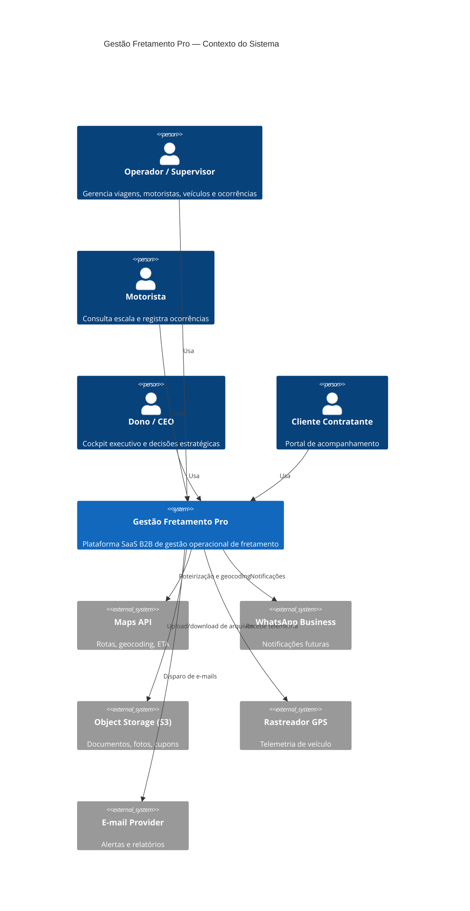

# 02 — Arquitetura de Produto Escalável

## Objetivo

Desenhar uma arquitetura que permita começar como MVP sem bloquear o crescimento para SaaS multiempresa, múltiplos módulos, dashboards por cargo, integrações, mobile, IA, telemetria e dados em tempo real.

## Diretriz principal

A arquitetura deve ser:

> Modular no código, relacional no dado, orientada a eventos na evolução e rigorosa em segurança.

## Modelo recomendado

### Fase inicial

**Monorepo modular**

Estrutura sugerida:

```txt
/apps
  /web-admin
  /api-core
  /worker
  /mobile-driver   # fase futura
  /mobile-passenger # fase futura

/packages
  /ui
  /config
  /types
  /validators
  /auth
  /database
  /eslint-config
  /tsconfig
```

### API principal

O backend principal deve conter módulos bem separados:

```txt
/api-core/src/modules
  /auth
  /tenants
  /users
  /roles-permissions
  /operation
  /trips
  /vehicles
  /drivers
  /clients
  /passengers
  /fuel
  /maintenance
  /documents
  /occurrences
  /finance
  /notifications
  /audit
  /analytics
```

## Estratégia de crescimento

### Etapa 1 — Modular Monolith

Tudo roda em uma API principal, mas com separação rígida por domínio.

Vantagens:

- velocidade;
- menos infraestrutura;
- menor custo;
- depuração simples;
- deploy unificado;
- melhor para validar mercado.

### Etapa 2 — Serviços auxiliares

Separar apenas o que tem carga diferente:

- worker de notificações;
- worker de relatórios;
- serviço de IA;
- serviço de ingestão de telemetria;
- serviço de arquivos.

### Etapa 3 — Event-driven

Quando houver volume:

- eventos de domínio;
- filas;
- stream de telemetria;
- processamento assíncrono;
- sincronização entre módulos;
- webhooks.

### Etapa 4 — Microsserviços seletivos

Extrair somente domínios que justifiquem:

- telemetria;
- IA;
- financeiro;
- integrações;
- notificações;
- analytics.

## Multiempresa desde o início

O produto deve nascer multiempresa.

Toda tabela operacional deve ter:

- `tenant_id`
- `created_at`
- `updated_at`
- `created_by`
- `updated_by`
- `deleted_at`, quando usar soft delete
- `status`
- campos de auditoria específicos quando necessário

## Estratégia de isolamento por tenant

### MVP

- `tenant_id` obrigatório em todas as consultas;
- middleware de contexto;
- repository/service nunca busca dado sem tenant;
- testes automatizados para evitar vazamento.

### Produção madura

- Row-Level Security no PostgreSQL;
- políticas por tenant;
- trilha de auditoria;
- logs de acesso;
- alertas de acesso anormal.

## Camadas do backend

```txt
Controller
  recebe requisição, valida autenticação, chama use case

Use Case / Application Service
  aplica regra de negócio

Domain Service
  regra de domínio reutilizável

Repository
  acessa dados

Policy / Permission Guard
  decide se usuário pode acessar/alterar

Audit Service
  registra ações relevantes

Event Publisher
  publica eventos de domínio
```

## Eventos de domínio

Eventos importantes desde o MVP:

- `TripCreated`
- `TripStarted`
- `TripCompleted`
- `TripDelayed`
- `DriverAssigned`
- `VehicleAssigned`
- `OccurrenceCreated`
- `FuelRecordCreated`
- `FuelAnomalyDetected`
- `DocumentExpiringSoon`
- `MaintenanceOrderCreated`
- `UserPermissionChanged`

Cada evento deve conter:

- `event_id`
- `tenant_id`
- `actor_user_id`
- `entity_type`
- `entity_id`
- `event_type`
- `payload`
- `created_at`
- `correlation_id`

## Tempo real

O sistema deve usar tempo real com critério.

### Entram no tempo real

- status de viagem;
- nova ocorrência;
- alteração de motorista/veículo;
- alerta crítico;
- abastecimento suspeito;
- documento vencendo;
- veículo parado;
- painel operacional.

### Não precisam ser tempo real

- cadastros simples;
- relatórios históricos;
- edição de contrato;
- cadastro financeiro não crítico.

## Regras para dashboards

Dashboard não é enfeite. É camada de decisão.

Cada dashboard deve ter:

- objetivo;
- público;
- período;
- KPIs principais;
- alertas;
- ranking;
- tabela de detalhe;
- drill-down;
- exportação controlada;
- permissão clara.

## Bounded Contexts (DDD Estratégico)

A plataforma deve ser dividida em contextos delimitados com contratos explícitos entre si. Isso evita acoplamento implícito e permite extração futura.

| Bounded Context | Tipo de Subdomínio | Responsável |
|---|---|---|
| Identity & Access | Genérico (comprar/OSS) | Auth, RBAC, Multitenancy |
| Operation & Trips | Core (vantagem competitiva) | Viagens, Rotas, Escalas |
| Fleet Management | Core | Veículos, Disponibilidade |
| Driver & HR | Suporte | Motoristas, Documentos pessoais |
| Fuel & Maintenance | Suporte | Abastecimento, Ordens de serviço |
| Client & Contract | Suporte | Clientes, Contratos, SLA |
| Finance | Suporte | Contas, Margem, Centros de custo |
| Notification | Genérico | Canal, template, entrega |
| Analytics & BI | Suporte | Dashboards, KPIs, Relatórios |
| AI Operational | Core futuro | Copiloto, Anomalias, Predição |

Regras de integração entre contextos:
- Contextos Core nunca dependem de contextos Suporte.
- Comunicação entre contextos via eventos de domínio ou DTOs — nunca via tabela compartilhada.
- Integrações com sistemas externos usam Anti-Corruption Layer (ACL) para proteger o domínio interno.

## State Machines Explícitas

Status são máquinas de estado — nunca strings livres. Cada transição deve ser guardada.

### Viagem

```
DRAFT → CONFIRMED → PREPARATION → IN_PROGRESS → COMPLETED
                             ↘ DELAYED → IN_PROGRESS
CONFIRMED → CANCELED
IN_PROGRESS → CANCELED (com justificativa obrigatória)
```

### Veículo

```
AVAILABLE → IN_OPERATION → AVAILABLE
AVAILABLE → IN_MAINTENANCE → AVAILABLE
AVAILABLE → UNAVAILABLE → AVAILABLE (reativação explícita)
ANY → DOCUMENT_PENDING (bloqueio por documento vencido)
```

### Ocorrência

```
OPEN → IN_ANALYSIS → AWAITING_RESPONSE → RESOLVED
RESOLVED → REOPENED → IN_ANALYSIS
OPEN → CRITICAL (escalação)
```

Implementação: usar enum tipado no backend com método `canTransitionTo(newStatus)` que lança exceção para transição inválida. Nunca aceitar status vindo do cliente diretamente.

## Saga Pattern para Fluxos Complexos

Criação de viagem envolve múltiplas entidades — use Saga de orquestração.

```txt
CreateTripSaga:
  1. ValidateTripInput
  2. CheckVehicleAvailability → revert: noop (ainda não alocado)
  3. ReserveVehicle → revert: ReleaseVehicleReservation
  4. CheckDriverAvailability → revert: noop
  5. AssignDriver → revert: UnassignDriver
  6. ValidateRouteExists → revert: noop
  7. CreateTripRecord → revert: MarkTripAsCanceled
  8. PublishTripCreatedEvent → revert: PublishTripCanceledEvent
  9. SendNotifications → revert: noop (best-effort)
```

Para MVP, use Saga via serviço de aplicação com transação compensatória manual. Em escala, migrar para Temporal ou Conductor com rastreabilidade de execução.

## Outbox Pattern — Garantia de Entrega de Eventos

Eventos de domínio NÃO devem ser publicados direto na fila antes do commit do banco. Use Outbox Pattern.

```txt
Fluxo:
1. TX inicia
2. Escreve a entidade (trip, fuel_record, etc.)
3. Escreve o evento na tabela outbox (mesma TX)
4. TX commita — dado e evento são atômicos
5. Worker de Outbox lê eventos pendentes e publica no broker
6. Após publicação confirmada, marca o evento como publicado
```

Tabela outbox mínima:

```sql
CREATE TABLE outbox_events (
  id          uuid PRIMARY KEY DEFAULT gen_random_uuid(),
  tenant_id   uuid NOT NULL,
  event_type  text NOT NULL,
  payload     jsonb NOT NULL,
  created_at  timestamptz NOT NULL DEFAULT now(),
  published_at timestamptz,
  retry_count int NOT NULL DEFAULT 0
);

CREATE INDEX ON outbox_events (published_at NULLS FIRST, created_at)
  WHERE published_at IS NULL;
```

## Diagrama C4 — Nível 1 (Contexto do Sistema)



## ADR — Decisão de Arquitetura: Monorepo Modular vs Microsserviços

**Status:** Aceito | **Data:** Fase inicial

**Contexto:** MVP com equipe pequena, sem escala de produção comprovada.

**Decisão:** Monorepo modular com separação rígida por domínio de negócio.

**Consequências positivas:** velocity alta, deploy unificado, debugging simples, refatoração cross-módulo mais fácil.

**Consequências negativas:** coupling acidental entre módulos se não houver disciplina; deploy granular não é possível por módulo.

**Alternativa rejeitada:** Microsserviços desde o início — adicionam complexidade operacional (service mesh, distributed tracing, contratos de API) antes de existir escala ou evidência de necessidade.

**Critério de revisão:** Revisar esta decisão quando qualquer módulo ultrapassar 50k req/min sustentado ou quando diferentes módulos exigirem SLOs distintos.

## Fitness Functions

Para evitar degradação arquitetural ao longo do tempo, adicionar verificações automatizadas no CI:

- Nenhum módulo importa diretamente de módulo irmão sem passar pela interface pública.
- Nenhum service importa diretamente de repository de outro contexto.
- Nenhuma query ao banco faz join entre tabelas de contextos diferentes sem passar por use case.
- Nenhum evento de domínio é publicado fora de use case ou application service.
- Toda tabela operacional tem `tenant_id NOT NULL`.

Implementar via ESLint custom rules (frontend), ArchUnit (se usar Java futuro), ou script de análise de imports no CI.

## Conclusão

A plataforma deve nascer como um produto modular, multiempresa e orientado a dados. O MVP precisa validar a operação, mas a arquitetura já deve permitir crescimento sem reescrever a base. Os bounded contexts, state machines explícitas, Outbox Pattern e fitness functions são fundação — não overengineering.
